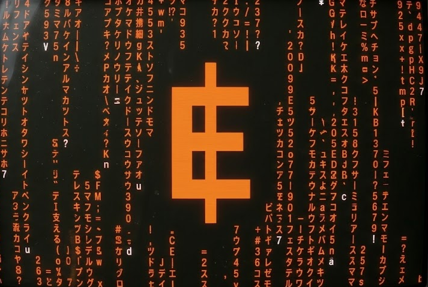

## **Mercenaries**
*Gas-efficient bounty contract system for EVE Frontier*

## Overview
An EVE Frontier d-app allowing users to place, track, and claim bounties on others in a way that is maximally gas efficient.
Complete with a frontend for browsing, posting, and claiming bounties.

## Changes Needed
Requires CCP to add public getter methods to killmails, exposing killer_id and victim_id.

## Future Plans
Bounties on entire tribes / corporations. Specific mercenary contracts for paying people to destroy corporation property, with granularity as to what type, dynamic payouts akin to the freelance jobs system in EVE.
